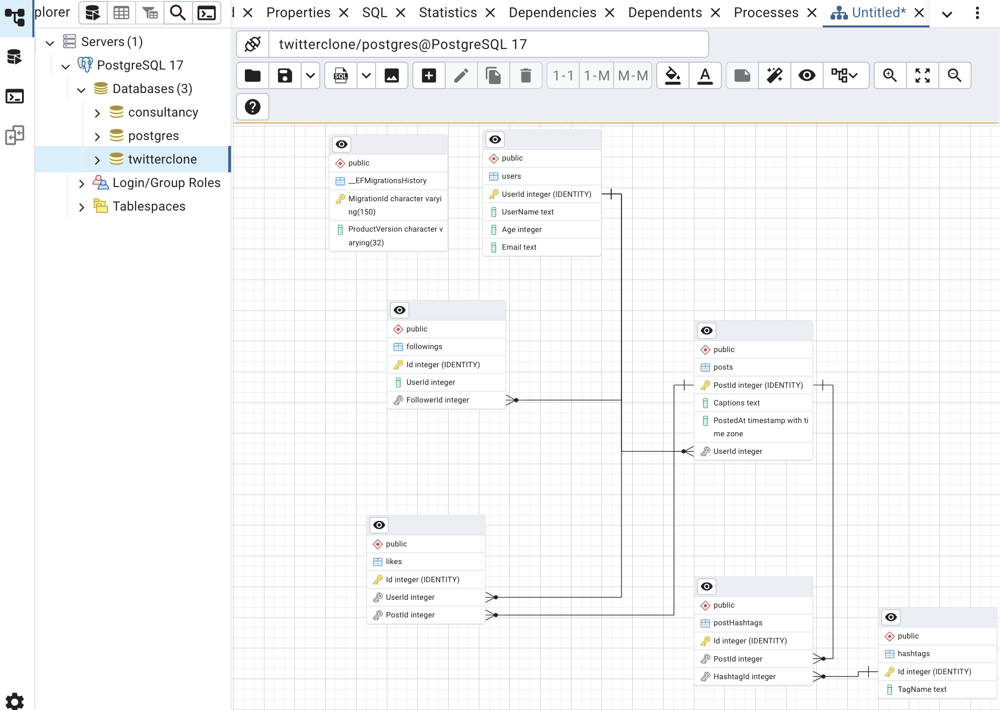

- You have been hired to build the backend for a Twitter-like application using .NET 8, Entity Framework Core (EF Core) with PostgreSQL as the database. 

- The application supports basic social media features such as user registration, posting tweets, liking tweets, using hashtags, and following users.

- Your goal is to model and implement the database layer only using EF Core with code-first approach, focusing on data design, relationships,  migrations, and PostgreSQL-specific features.

Commands and packages : 

dotnet tool install --global dotnet-ef
dotnet ef
dotnet ef migrations add init

dotnet add package Microsoft.EntityFrameworkCore.Design --version 9.0.5
dotnet add package Microsoft.AspNetCore.OpenApi --version 9.0.5
dotnet add package Npgsql.EntityFrameworkCore.PostgreSQL --version 9.0.4
dotnet add package Npgsql --version 9.0.3
dotnet add package Swashbuckle.AspNetCore --version 8.1.2

