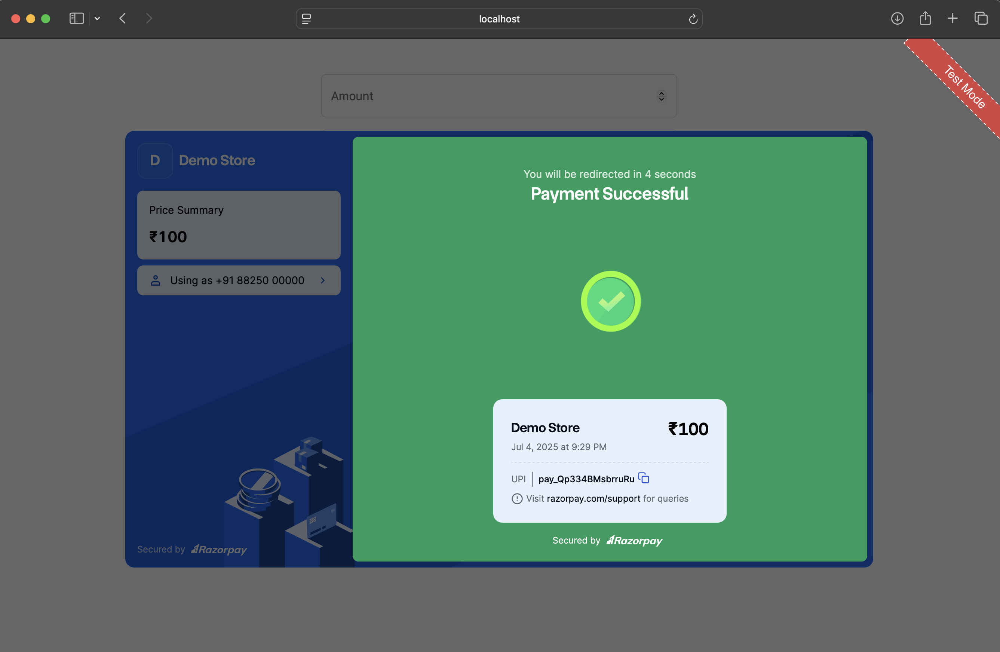
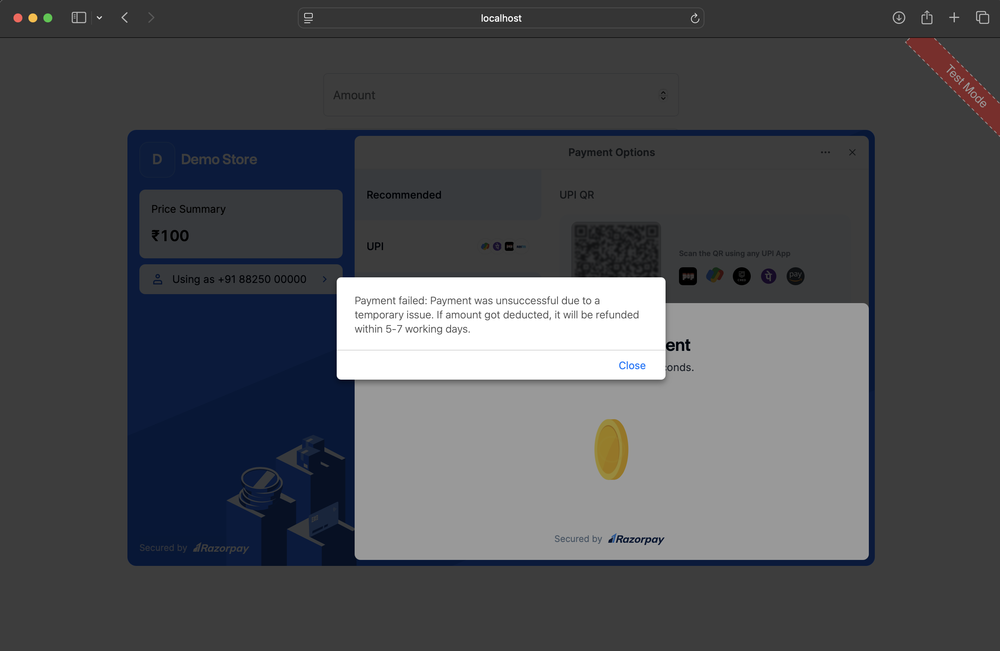
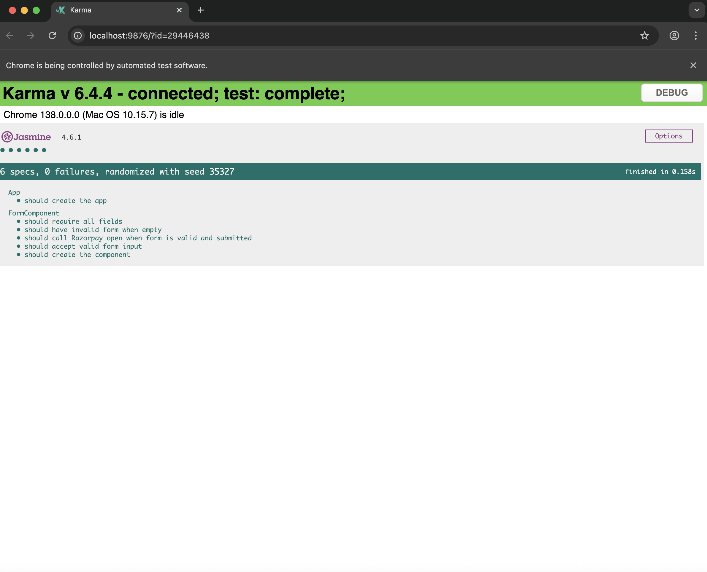

# 💳 Angular Payment App (Razorpay Integration)

This Angular application demonstrates Razorpay payment integration using reactive forms, complete with validation, unit tests, Dockerization, and deployment via NGINX.

---

## 🚀 Features

- ✅ Razorpay payment integration (test mode)
- ✅ Reactive form with full validation:
  - Amount (required, > 0)
  - Customer Name (required)
  - Email (required, valid)
  - Contact Number (required, 10 digits)
- ✅ Unit tests using Jasmine + Karma
- ✅ Dockerized for production with NGINX
- ✅ Screenshots for success and failure flows





## 🐳 Docker Commands

### 🔨 1. Build the Docker Image

From the root of your Angular project (where the Dockerfile is located):

To build image & run the container

```bash
docker build -t paymentapp .

docker run -d -p 8080:80 paymentapp
