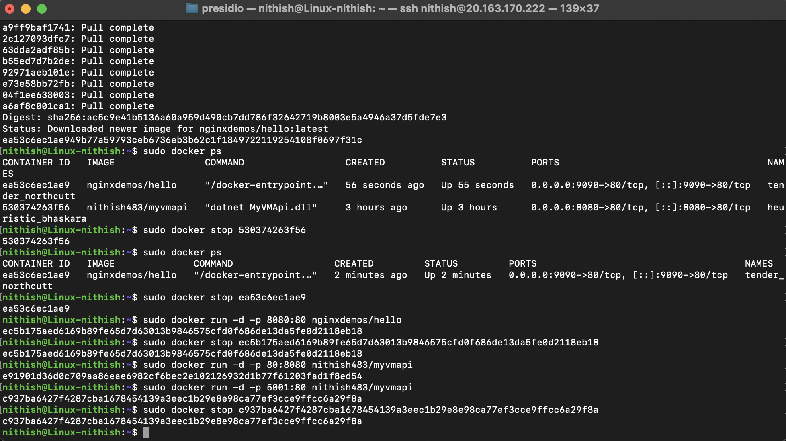
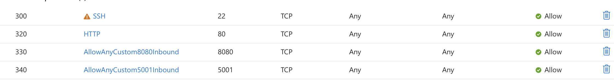
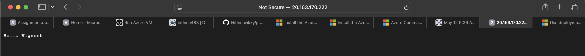
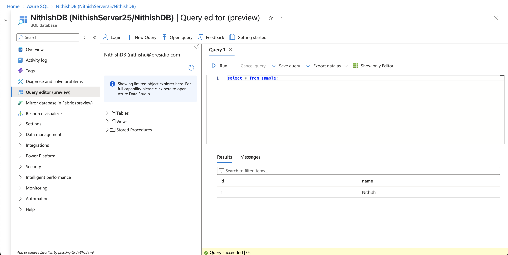

### Created Linux VM and Connected it to LM

- Installed Docker in vm via cli.

- Created dotnet webapi `MyVMApi` in local machine.
 - Simple Api which greete usernames

- Built the image of the api and pushed it to DockerHub.

- Pulled the image from hub to VM machine docker 
- Ran the pulled image 

### Adding inbound rule in Azure portal to access Exposed ports

- Accessing the api using the public ip address

### Deployed Server & database via cli using template

- Allowed all ip address in the firewall of DB in Azure

- Executed queries to verify database working

