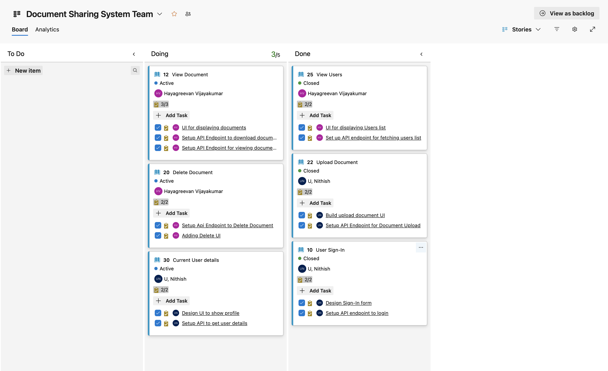
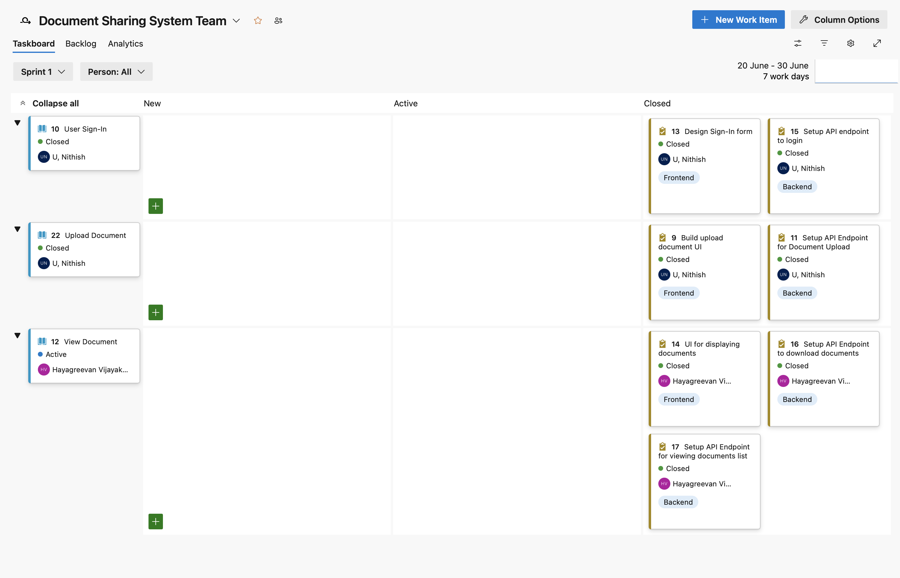
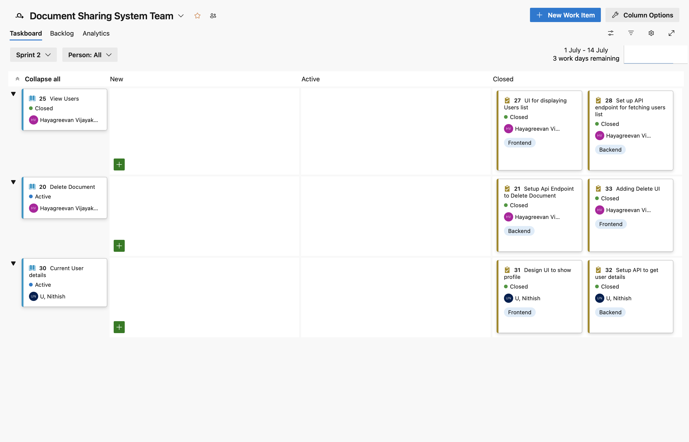
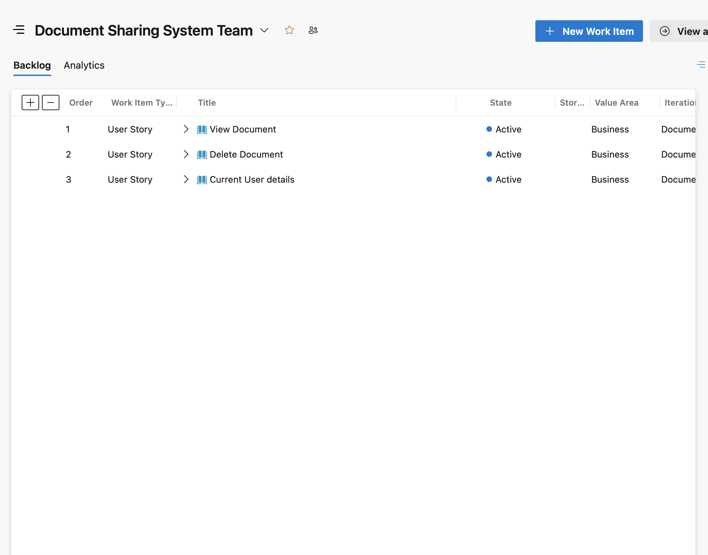
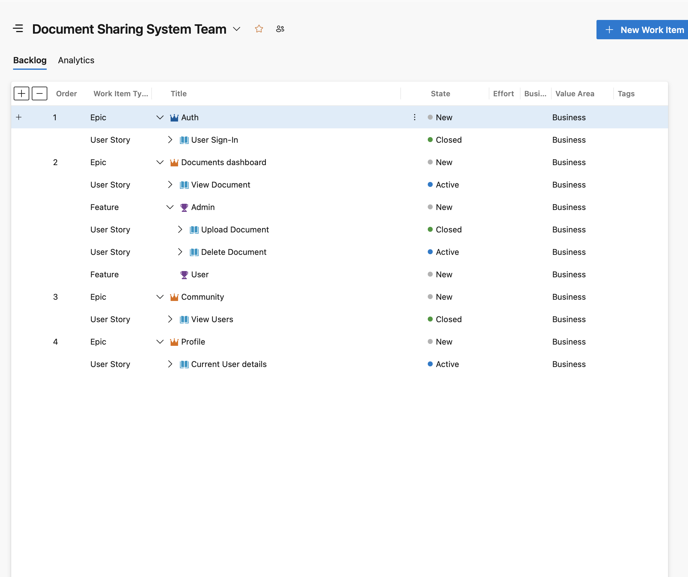
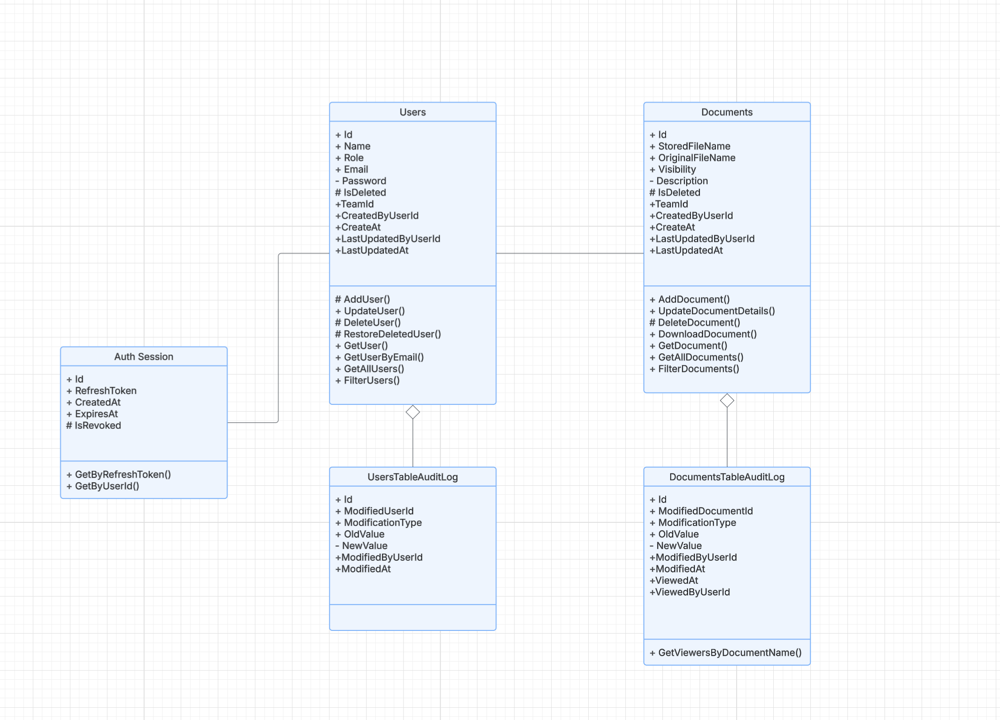

### Created Work items

#### Used Work Items
    - Epic
    - Feature
    - User story
    - Tasks

- Assinged task for each
- Tagged each task for the clarity
- Prioritized the task by rank
- Made link of parent-child between 
    Epic -> User story -> Tasks

##### Kanban Board

### Scheduled Sprints

#### Sprint 1 (20 June - 30 June)

User Story
- `User Sign-In`'s Tasks
- `Upload Document`'s Tasks
- `View Document`'s Task

##### Sprint 1

#### Sprint 2 (1 July - 14 July)

User Story
- `Delete Document`'s Tasks
- `Current User`'s Tasks

##### Sprint 2

### Backlogs & Overview

#### Backlogs (Active ongoing items)

#### Overview tree structure

### Class diagram
